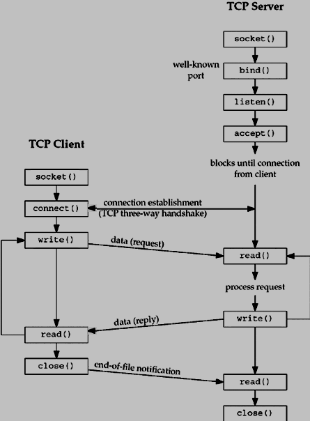
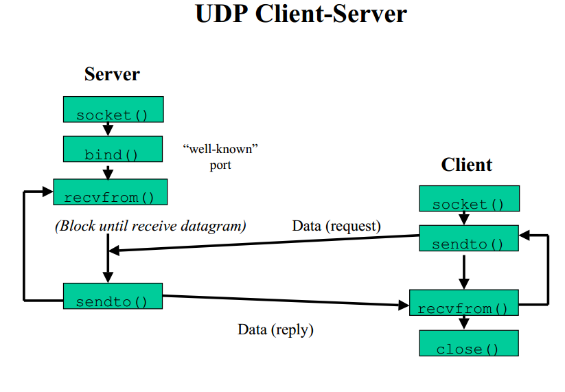
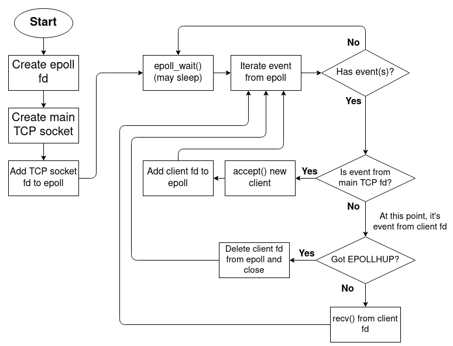

- [1. TCP v/s UDP latency](#1-tcp-vs-udp-latency)
- [2. Epoll](#2-epoll)
  - [2.1. Epoll advanatges](#21-epoll-advanatges)
  - [2.2. EPoll loop based server and Client](#22-epoll-loop-based-server-and-client)
  - [2.3. EPoll Events to know and listen for](#23-epoll-events-to-know-and-listen-for)
  - [2.4. EPoll Read/Write errno](#24-epoll-readwrite-errno)
  - [2.5. EPoll Level Triggered vs Edge Triggered](#25-epoll-level-triggered-vs-edge-triggered)
  - [2.6. EPoll Timer loop how to](#26-epoll-timer-loop-how-to)
  - [2.7. Simple EPoll Server Single Threaded](#27-simple-epoll-server-single-threaded)
- [3. TCP Server Client](#3-tcp-server-client)
  - [3.1. EventFD notify](#31-eventfd-notify)
- [4. UDP Server Client](#4-udp-server-client)
- [5. EPOLL Based Server client](#5-epoll-based-server-client)
- [Setting socket to be non-blocking](#setting-socket-to-be-non-blocking)
- [Epoll example code](#epoll-example-code)


# 1. TCP v/s UDP latency


# 2. Epoll 
## 2.1. Epoll advanatges

## 2.2. EPoll loop based server and Client

## 2.3. EPoll Events to know and listen for

EpollErrors to listen for
EPOLLERR| EPOLLRDHUP | EPOLLHUP | 

EpollIn connection: EPOLLIN 
EpollOut connection: EPOLLOUT

## 2.4. EPoll Read/Write errno

EAGAIN, EWOULDBLOCK, ECONNRESET, EINTR

```


// check if the event is for writing


if (events & ( EPOLLERR| EPOLLRDHUP | EPOLLHUP ))
{
    // Error event
    // restart connection
    return;
}

if (events & EPOLLOUT)
{
    // TBD - when to check EAGAIN?
    cout << "Writtable" ;
    writeLen = send(fd, buffer.out_pos, buff.size());
}

if (events & EPOLLIN)
{
    // TBD - when to check EAGAIN?
    cout << "Readable" ;
}


do
{
    len = read(fd, inbuffer.in_pos(), sizeofBuffer);
} while (-1 == len && EINTR == errno)

if (len > 0)
{
    // all good 
    inbuffer.incr_pos(len);
}
else if ( (len ==0) || ((len == -1) && (ECONNRESET == errno) )
{
    // Read Error - client disconnected - close the connection
}
else if ( (len == -1) && (EAGAIN == errno || errno == EWOULDBLOCK) )
{
    // all good - nothing to read - start waiting
}

```

## 2.5. EPoll Level Triggered vs Edge Triggered

## 2.6. EPoll Timer loop how to

1. Create a timer_fd
2. Add to the epoll_ctl and register EPOLLIN
3. When the event is generated for timer_fd - read the data - so that it knows the event is actioned.
4. Do the required task - if any
5. go back to the epoll_wait loop.

## 2.7. Simple EPoll Server Single Threaded

1. Listen for incoming connection or incoming read
2. When read.. read the data and write back to the socket. If Write fails or not enough space in buffer. Go back and listen but this time register the EPOLLOUT so that as soon as the write is ready you will get callback.
3. When you get the callback from the epoll_wait check if its for EPOLLOUT.. then send the remaining data.
4. If the callback is to read the data, then read the data.
5. Set the mask again based on if you want to listen for read or write data. 


# 3. TCP Server Client

## 3.1. EventFD notify 

https://www.yangyang.cloud/blog/2018/11/09/worker-pool-with-eventfd/

static void *producer_routine(void *data) {
    struct thread_info *p = (struct thread_info *)data;
    struct epoll_event event;
    int epfd = p->epfd;
    int efd = -1;
    int ret = -1;
    int interval = 1;

    log_debug("[producer-%d] issues 1 task per %d second", p->rank, interval);
    while (1) {
        efd = eventfd(0, EFD_CLOEXEC | EFD_NONBLOCK);
        if (efd == -1) exit_error("eventfd create: %s", strerror(errno));
        event.data.fd = efd;
        event.events = EPOLLIN | EPOLLET;
        ret = epoll_ctl(epfd, EPOLL_CTL_ADD, efd, &event);
        if (ret != 0) exit_error("epoll_ctl");
        ret = write(efd, &(uint64_t){1}, sizeof(uint64_t));
        if (ret != 8) log_error("[producer-%d] failed to write eventfd", p->rank);
        sleep(interval);
    }
}

# 4. UDP Server Client

https://stackoverflow.com/questions/23068905/is-bind-necessary-if-i-want-to-receive-data-from-a-server-using-udp





# 5. EPOLL Based Server client

https://stackoverflow.com/questions/66916835/c-confused-by-epoll-and-socket-fd-on-linux-systems-and-async-threads




Addition to the diagram
- When recv receives 0 len data. The client connection needs to be closed.
- 

# Setting socket to be non-blocking


```
static int setnonblocking(int sockfd)
{
    // Get the file descriptor and set it.
	if (fcntl(sockfd, F_SETFD, fcntl(sockfd, F_GETFD, 0) | O_NONBLOCK) ==
	    -1) {
		return -1;
	}
	return 0;
}
```

# Epoll example code

https://github.com/solacerace/epoll-example/blob/master/epoll.c


https://github.com/solacerace/epollServer/tree/master/src


